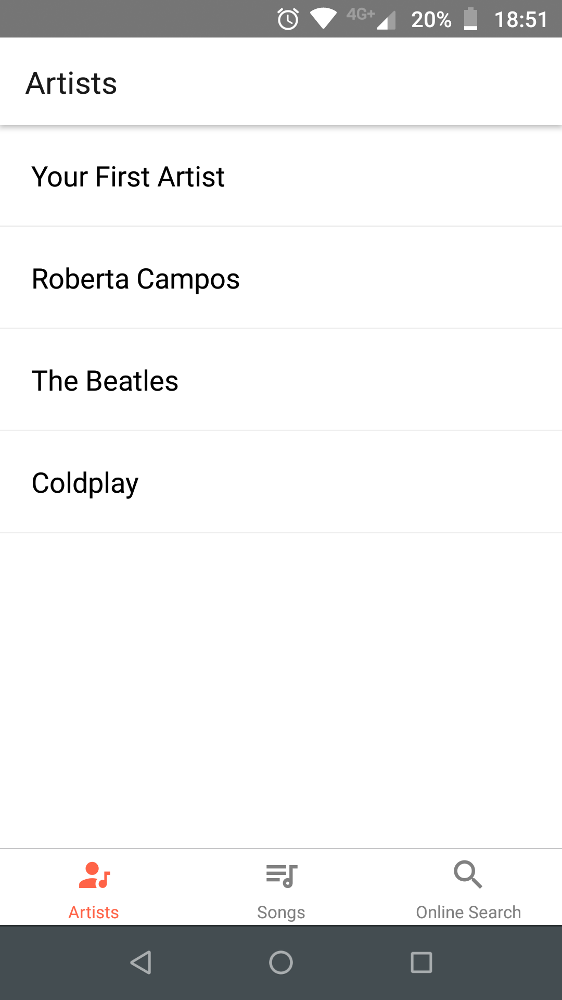
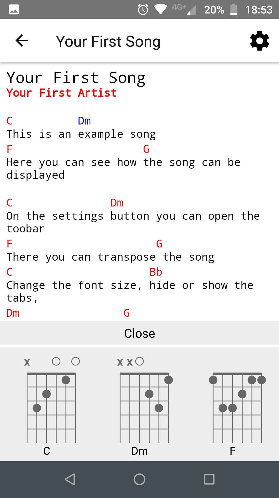
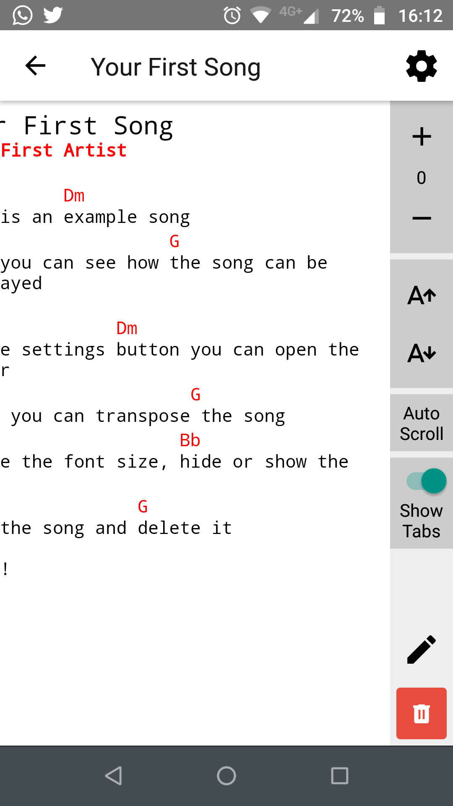
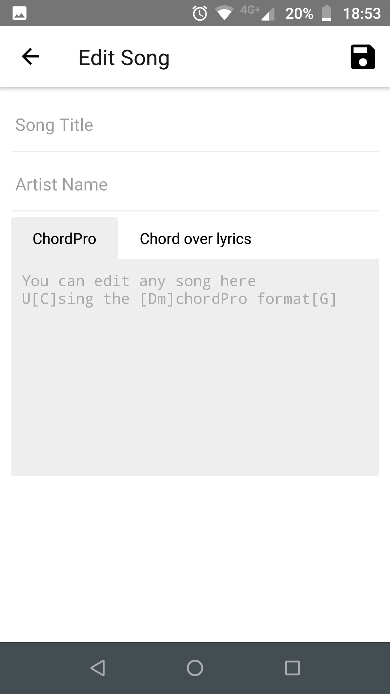

# OpenChord
Cross-platform chordpro reader app for Android and iOS written with React Native.

[](https://travis-ci.org/artutra/OpenChord)
[](http://makeapullrequest.com)
[](https://www.gnu.org/licenses/gpl-3.0)
[](https://david-dm.org/artutra/OpenChord)

<p style="display: flex;flex-wrap: wrap; align-items: center;justify-content: center">
  <a href="#">
    
  </a>
  <a href="https://play.google.com/apps/testing/com.openchord">
    
  </a>
</p>

# :camera: Screenshots

<p float="left">
  
  
  
  
  
</p>

# Features
Open Chord is a React Native application for both Android and iOS that allows you to organize your chord charts, lyric sheets and songbooks with a simple app on your tablet or smartphone. Open Chord easily allows you to get rid of all that paper by displaying your music in a flexible, easy to read format.

A few features include:

| Feature                          | Support            |
|:-------------------------------- |:------------------:|
| Render song with chordpro format | :heavy_check_mark: |
| Import songs from the web        | :heavy_check_mark: |
| Transpose song                   | :heavy_check_mark: |
| Create/edit song                 | :heavy_check_mark: |
| Show/hide tabs                   | :heavy_check_mark: |
| Configure font size              | :heavy_check_mark: |
| Show guitar chord diagrams       | :heavy_check_mark: |
| Autoscroll                       | :heavy_check_mark: |
| Manage playlists                 | :clock2:           |
| Search saved songs               | :clock2:           |
| Slide with touch                 | :clock2:           |
| Slide with volume button         | :clock2:           |
| Multiple columns visualization   | :clock2:           |
| Multiple languages support       | :clock2:           |
| Chord dictionary                 | :clock2:           |
| Playlist presentation mode       | :clock2:           |

:heavy_check_mark: = supported

:clock2: = will be supported in a future version

:heavy_multiplication_x: = currently no plans to support it in the near future

## Try it yourself

### 1. Clone and Install

```bash
# clone the repo
git clone https://github.com/artutra/OpenChord.git

# Open the folder and install dependencies
cd OpenChord && npm install
```

### 2. Generate `songs.json` file
```bash
# Run
npm run build:chordpro
```
It will merge all `.cho`, `.crd`, `.chopro`, `.chord` and `.pro` files inside `./assets/chordpro` into a single `songs.json` file that will be imported in the app.

Obs: If you pass the flag `prod` (ex: `npm run build:chordpro prod`) it will only merge files that *not* contains `.test` on the name

### 3. Run it on both iOS and Android
```bash
# Run on iOS
npm run build:ios

# Run on Android
npm run build:android
```
### Or use Docker (for Android)
```bash
# Build the container and run the build scripts inside it
docker-compose run --service-ports android bash
```
Obs: The docker container can't attatch to the device via USB. You have to build the app-debug.apk using `npm run build:android`, copy the generated file inside `./android/app/build/outputs/apk/debug/app-debug.apk` and install it manually on the device.


## Built With

* [React Native v0.60](https://facebook.github.io/react-native/) - The framework for building native apps using React
* [Realm v3.0](https://github.com/realm/realm-js) - Realm is a mobile database that runs directly inside phones, tablets or wearables
* [React Navigation v4.0](https://reactnavigation.org) - React Native module support navigation
* [React Native Vector Icons v6.6](https://github.com/oblador/react-native-vector-icons) - Customizable Icons for React Native with support for NavBar/TabBar/ToolbarAndroid, image source and full styling
* [React Native Webview](https://github.com/react-native-community/react-native-webview) - A modern, well-supported, and cross-platform WebView for React Native
* [ChordSheetJS](https://github.com/martijnversluis/ChordSheetJS) - A JavaScript library for parsing and formatting chord sheets
* [ChordPro](https://www.chordpro.org/chordpro/index.html) - A text file format to write lead sheets, songs with lyrics and chords

## How can you help
If you find any problems, feature requests, please open an issue or submit a fix as a pull request.

## License
[GNU General Public License v3.0](LICENSE)